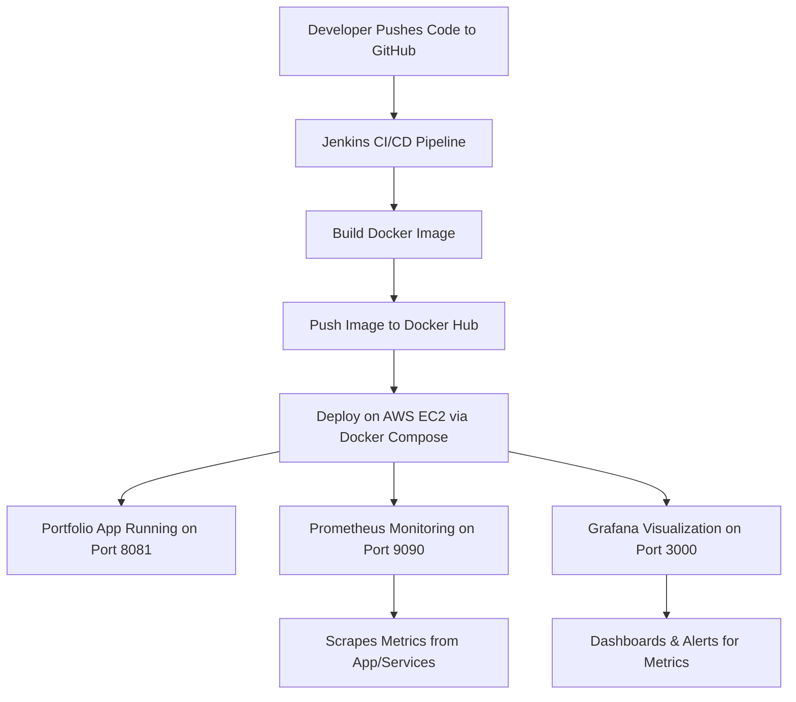

# 🚀 End-to-End DevOps Portfolio Deployment with Monitoring

This repository contains the source code for my personal portfolio website, which also demonstrates a **complete CI/CD pipeline** that takes code from **GitHub → Jenkins → Docker Hub → AWS EC2 → Docker Compose**, with **Prometheus & Grafana** providing full observability.

It automates everything from **build → push → deploy → monitor**, proving an industry-grade DevOps workflow.

---
<center>

[](https://forthebadge.com) &nbsp;
[](https://forthebadge.com) &nbsp;
[](https://forthebadge.com) &nbsp;
 &nbsp;


</center>

<h3 align="center">
    🔹
    <a href="https://github.com/AdityaKonda6/my-portfolio-adityakonda/issues">Report Bug</a> &nbsp; &nbsp;
    🔹
    <a href="https://github.com/AdityaKonda6/my-portfolio-adityakonda/issues">Request Feature</a>
</h3>

---

## 📌 Architecture Overview



---

## 🏗️ Tech Stack

* **Version Control:** GitHub
* **CI/CD:** Jenkins (Pipeline-as-Code with Jenkinsfile)
* **Containerization:** Docker & Docker Hub
* **Orchestration:** Docker Compose v2
* **Cloud Hosting:** AWS EC2 (Ubuntu)
* **Monitoring:** Prometheus (metrics) + Grafana (dashboards & alerts)

---

## ⚡ End-to-End Workflow

### **1. Development**

* Build your **Portfolio Application** (React/Next.js + Nginx).
* Add `Dockerfile`, `docker-compose.yml`, `prometheus.yml`, and `Jenkinsfile` to repo.
* Push to **GitHub**.

---

### **2. Continuous Integration (CI)**

* GitHub webhook triggers Jenkins.
* Jenkins pipeline executes:

  * **Build Docker image** from `Dockerfile`.
  * **Tag & Push** image to Docker Hub (`adityakonda/aditya_portfolio:latest`).

---

### **3. Continuous Deployment (CD)**

* Jenkins connects to **AWS EC2** via SSH.
* Creates `~/portfolio-deployment/`.
* Copies `docker-compose.yml` and `prometheus.yml`.
* Ensures **Docker Compose v2** is installed (self-healing step).
* Executes:

  ```bash
  docker compose pull
  docker compose up -d
  ```

---

### **4. Monitoring & Observability**

* **Prometheus** scrapes metrics from services.
* **Grafana** visualizes metrics with dashboards and alerts.
* Accessible endpoints:

  * Portfolio App → `http://<EC2-Public-IP>:8081`
  * Prometheus → `http://<EC2-Public-IP>:9090`
  * Grafana → `http://<EC2-Public-IP>:3000` (default login: `admin/admin`)

---

## 📂 Repository Structure

```
├── Dockerfile              # Build instructions for portfolio app
├── docker-compose.yml      # Orchestration for app + monitoring stack
├── prometheus.yml          # Prometheus config for scraping targets
├── Jenkinsfile             # CI/CD pipeline definition
└── README.md               # Project documentation
```

---

## ⚙️ Setup Instructions

### **1. Prerequisites**

* AWS EC2 (Ubuntu, Docker installed)
* Jenkins server (with `docker` + `docker pipeline` plugins)
* Docker Hub account
* GitHub repo

---

### **2. Jenkins Setup**

1. Add credentials:

   * `dockerhub-creds` → Docker Hub username/password (or token).
   * `ec2-ssh-key` → Private SSH key for EC2 access.
2. Create a pipeline job pointing to this repo.
3. Ensure GitHub webhook → Jenkins.

---

### **3. Deployment**

Jenkins automatically:

* Builds and pushes image.
* Deploys stack to EC2.
* Starts:

  * `portfolio-app` on port **8081**
  * `prometheus` on port **9090**
  * `grafana` on port **3000**

---

### **4. Monitoring Setup**

1. Login to Grafana (`admin/admin` → set new password).
2. Add Prometheus as a data source:

   ```
   http://prometheus:9090
   ```
3. Import a Docker monitoring dashboard (Grafana.com IDs: `193`, `3662`, `893`).
4. Observe real-time CPU, memory, uptime, and container health.

---

## ⚙️ Getting Started (Local Development)

To get a local copy up and running, follow these simple steps.

### Prerequisites
You will need `node.js` and `git` installed globally on your machine.

### Installation
1.  Clone the repo:
    ```sh
    git clone [https://github.com/AdityaKonda6/my-portfolio-adityakonda.git](https://github.com/AdityaKonda6/my-portfolio-adityakonda.git)
    ```
2.  Install NPM packages:
    ```sh
    npm install
    ```
3.  Run the app in development mode:
    ```sh
    npm start
    ```
    Open [http://localhost:3000](https://www.google.com/search?q=http://localhost:3000) to view it in your browser.

---

---

## 📊 Sample Images


---

## 🔮 Next Steps

* Add **Node Exporter** for EC2 system metrics.
* Add **cAdvisor** for detailed container metrics.
* Configure Grafana alerts (Email/Slack/Telegram).
* Automate infra setup with Terraform + Ansible.

---

## 🏆 Key Learnings

✅ CI/CD pipelines with Jenkins
✅ Secure image storage in Docker Hub
✅ Automated deployments with Docker Compose
✅ Real-time observability using Prometheus + Grafana

---

## 💡 Challenges & Solutions
This section details two significant technical challenges faced during development and pipeline setup, outlining the diagnostic process and the implemented solutions.

### Challenge 1: "JavaScript Heap Out of Memory" During CI Build
* **Problem:** The `npm run build` command, when executed by Jenkins on the EC2 server, would crash with a fatal error: `FATAL ERROR: Ineffective mark-compacts near heap limit Allocation failed - JavaScript heap out of memory`.
* **Diagnostic Process:** The error message clearly indicated that the Node.js process did not have enough memory (heap) to complete the compilation and optimization of the React application. This is a common issue in resource-constrained environments like a small EC2 instance, where the default memory allocation for Node.js is insufficient.
* **Solution:** The fix was to explicitly increase the memory available to the Node.js process. I modified the build step in the `Jenkinsfile` to pass a specific flag to Node.js.
    * **Original command:** `sh 'npm run build'`
    * **Modified command:**
        ```groovy
        sh 'NODE_OPTIONS=--max-old-space-size=4096 npm run build'
        ```
    This command sets an environment variable `NODE_OPTIONS` just for this execution, instructing Node.js to allow its heap size to grow up to 4096 MB (4 GB). This provided more than enough memory for the build to complete successfully.

### Challenge 2: "ENOSPC" Error During Local Development
* **Problem:** While running the development server via `npm start`, my machine would often throw the error: `Error: ENOSPC: System limit for number of file watchers reached`. This would crash the server, requiring a manual restart.
* **Diagnostic Process:** The `ENOSPC` error in this context means "Error, No Space," but it refers to the system's limit for file watchers, not disk space. React's development server watches every file in the project (including the thousands in `node_modules/`) for changes to enable hot-reloading. My operating system had a low default limit, which was quickly exhausted.
* **Solution:** The solution was to increase the maximum number of file watchers allowed by the operating system. On my Linux (Ubuntu) distribution, this was achieved with a simple system configuration change.
    1.  I added a new value to the system control configuration file:
        ```sh
        echo fs.inotify.max_user_watches=524288 | sudo tee -a /etc/sysctl.conf
        ```
    2.  I then applied the new setting immediately without needing a reboot:
        ```sh
        sudo sysctl -p
        ```
    This command increased the limit to 524,288, a sufficiently large number to handle any modern web development project. The error was permanently resolved.
---

> 🚀 This project shows how you can build a **production-grade DevOps pipeline** as a fresher — taking code from GitHub all the way to monitored infrastructure on AWS.

-----

## Hey there 👋, I'm [<a href="https://adityakonda04.vercel.app/">Aditya!</a>](https://github.com/AdityaKonda6)

[](https://www.linkedin.com/in/aditya-adi-konda/)
[](https://twitter.com/AdityaKonda7)
[](https://www.instagram.com/konda_aditya/)


### Glad to see you here! &nbsp; 

I’m a **2025 IT Graduate** passionate about **DevOps, Cloud, and Software Development** 🚀.  
My mission? To **bridge the gap between development and operations**—building scalable systems, automating workflows, and ensuring quality from code to deployment.

With a strong foundation in **Java, SQL, Linux**, and hands-on experience with **CI/CD pipelines, Selenium automation, cloud services, and Android development**, I thrive in solving problems end-to-end—from writing code to deploying it in production.

Recently, at **CWD Limited**, I worked on:
- **Automation Testing Frameworks** (Selenium, Java, Maven)
- **Linux-based system configurations & debugging**
- **Hardware-software integration testing**
- API testing with Postman  
…and in the process, strengthened my DevOps skill set.

💡 Curious mind. Fast learner. Always ready to build, break, and rebuild—better.

---

### 🚀 What I’m Working On:
- Building **DevOps projects** (Jenkins, Docker, Kubernetes, AWS, Ansible)
- Enhancing **automation frameworks** for testing & deployment
- Crafting **Android apps** and backend services
- Expanding my **Linux administration** skills

---

### 💼 My Tech Stack:
<code></code>
<code></code>
<code></code>
<code></code>
<code></code>
<code></code>
<code></code>
<code></code>
<code></code>
<code></code>
<code></code>
<code></code>
<code></code>

---


### 📌 Highlights:
- 🛠 Built **dynamic Selenium automation scripts** integrated with Maven
- 🚀 Created & deployed **full-stack and Android applications**
- 🐧 Comfortable with **Linux system administration & shell scripting**
- 📦 Implemented CI/CD workflows for smoother deployments
- ☁️ Learning & applying **cloud infrastructure concepts**

--

### 📫 How to Reach Me:
- Email: **adityakonda04@gmail.com**
- Portfolio: [adityakonda04.vercel.app](https://adityakonda04.vercel.app/)
- LinkedIn: [Aditya Adi Konda](https://www.linkedin.com/in/aditya-adi-konda/)

---

### 📊 GitHub Stats:
<details>
  <summary><b>⚡ GitHub Stats</b></summary>
  <br />
  
  
</details>

<details>
  <summary><b>🔥 GitHub Streaks</b></summary>
  <br />
  
</details>

<details>
  <summary><b>☄️ LeetCode Stats</b></summary>
  <br />
   <p align="center"></p>
</details>

---

💬 Always open to collaborations, tech discussions, and exploring new opportunities in **DevOps, Cloud, and Software Development**.


Like My Work?

<a href="https://www.buymeacoffee.com/adityakonda04" target="_blank"></a>

<p align="left">  </p>

<p align="left"> <a href="https://github.com/ryo-ma/github-profile-trophy"></a> </p>


<div align="center">

[](https://github.com/im-ukr)


### Show some ❤️ by starring some of the repositories!
### <a href="https://adityakonda04.vercel.app/">My Portfolio</a>
</div>
